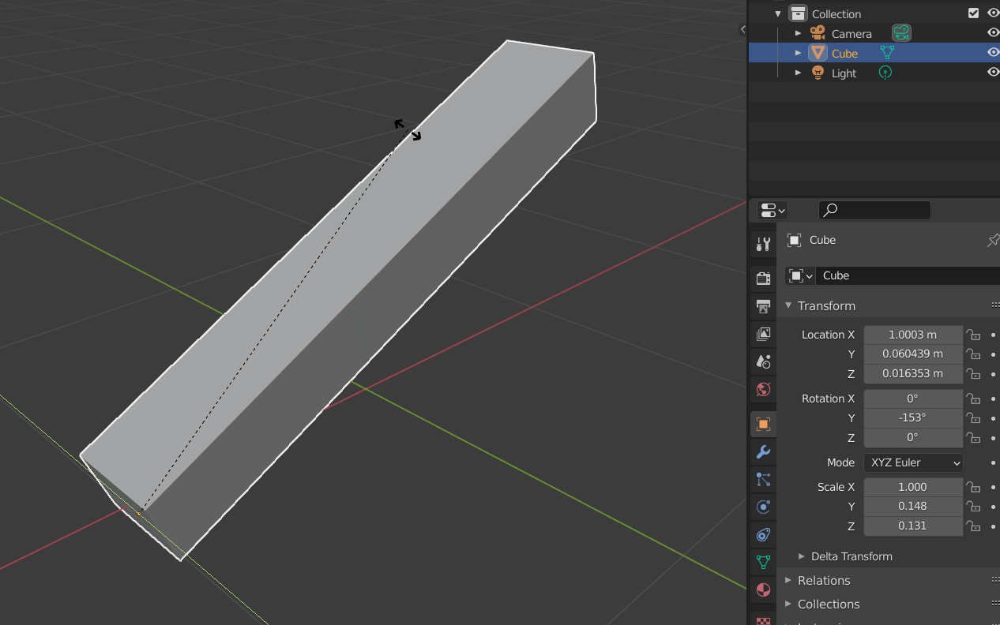

# [오브젝트의 Origin 설정]

막대모양의 오브젝트를 회전하는 경우를 생각해보자.  

만약 레버를 당겨서 내리는 연출을 한다면,  

레버의 끝을 중심으로 하여 회전해야 한다.  

하지만 아무런 조치 없이 오브젝트를 회전하게 될 경우

위의 그림처럼 오브젝트의 중앙을 중심으로 회전하게 된다.  

 
 

모델링 툴에서는 오리진의 위치를 변경해서 레버의 회전을 연출할 수 있다.

유니티에서도 해당 연출이 가능하도록 하기 위해 Empty Object를 생성하여

Origin으로 사용하도록 하였다.

 
 

Empty Object를 생성하고 원하는 위치에 배치한다.
위의 이미지에서는 Origin 이라는 이름으로 생성하였다.

 
 

회전하고 싶은 오브젝트를 자식오브젝트로 만들어준다.

 
 

Origin의 Rotation 값을 변경하여 회전한다.
위의 방법을 통해 원하는 위치를 기준으로 오브젝트를 회전시킬 수 있다.